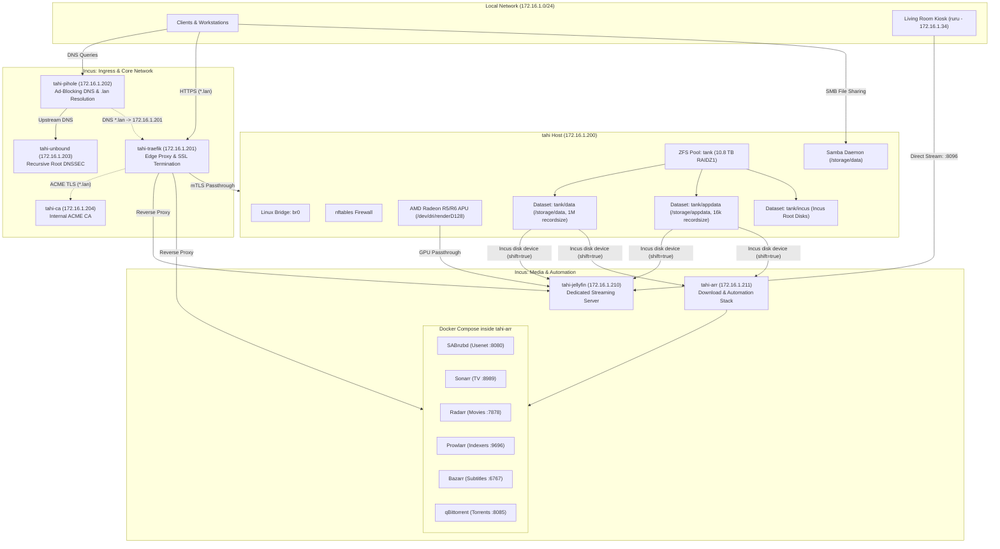

# 🌐 tahi — Services & Infrastructure Reference

This document provides a comprehensive, production-grade architectural and operational reference for all services, containers, storage pools, and network routing running on **`tahi`** (`172.16.1.200`).

---

## 🏗️ High-Level Infrastructure Topology



---

## 📋 Service Directory & Endpoints

All web services are securely exposed on the local network via trusted HTTPS certificates issued by the internal Certificate Authority (`tahi-ca`) and routed through `tahi-traefik`.

| Service | Container | IP Address | Internal Port | Public URL | Purpose / Notes |
| :--- | :--- | :--- | :--- | :--- | :--- |
| **Traefik** | `tahi-traefik` | `172.16.1.201` | `80`, `443` | `https://traefik.lan` | Edge reverse proxy & SSL termination |
| **Step-CA** | `tahi-ca` | `172.16.1.204` | `443` | `https://ca.lan` | Smallstep Internal Certificate Authority |
| **Pi-hole** | `tahi-pihole` | `172.16.1.202` | `53`, `80` | `https://pihole.lan` | Network DNS ad-blocker & `.lan` resolver |
| **Unbound** | `tahi-unbound` | `172.16.1.203` | `53` | `172.16.1.203:53` | Recursive root DNS with DNSSEC |
| **Incus Web UI** | `tahi` (Host) | `172.16.1.200` | `8443` | `https://incus.lan` | Incus container/VM management console (mTLS) |
| **Jellyfin** | `tahi-jellyfin` | `172.16.1.210` | `8096` | `https://jellyfin.lan` | Hardware-accelerated media streaming server |
| **SABnzbd** | `tahi-arr` | `172.16.1.211` | `8080` | `https://sabnzbd.lan` | Usenet NZB download client (encrypted NNTP) |
| **Sonarr** | `tahi-arr` | `172.16.1.211` | `8989` | `https://sonarr.lan` | TV series collection automation & management |
| **Radarr** | `tahi-arr` | `172.16.1.211` | `7878` | `https://radarr.lan` | Movie collection automation & management |
| **Prowlarr** | `tahi-arr` | `172.16.1.211` | `9696` | `https://prowlarr.lan` | Centralized indexer proxy & automation sync |
| **Bazarr** | `tahi-arr` | `172.16.1.211` | `6767` | `https://bazarr.lan` | Subtitle downloader for Sonarr & Radarr |
| **qBittorrent** | `tahi-arr` | `172.16.1.211` | `8085` | `https://qbit.lan` | BitTorrent client (`:6881` BT traffic) |
| **Samba** | `tahi` (Host) | `172.16.1.200` | `445`, `139` | `smb://tahi/data` | Network storage share for `/storage/data` |

---

## 💽 Storage Architecture & ZFS Datasets

The storage array consists of **3 × 6 TB Western Digital Red HDDs** configured in a **ZFS RAIDZ1** pool named `tank` (~10.8 TB usable capacity).

### 1. Dataset Layout & Recordsize Tuning

| Dataset | Mountpoint | Record Size | Compression | Purpose |
| :--- | :--- | :--- | :--- | :--- |
| `tank/data` | `/storage/data` | `1M` | `zstd` | Streaming media libraries & active download staging |
| `tank/appdata` | `/storage/appdata` | `16k` | `zstd` | SQLite databases & persistent container configs |
| `tank/incus` | Legacy / Incus | `128k` | `lz4` | Incus container root filesystems (35 GiB quota each) |

### 2. TRaSH Guides Directory Structure & Zero-Copy Hardlinks

To prevent duplicated disk space and disk I/O thrashing during download imports, `/storage/data` follows the unified single-filesystem structure:

```
/storage/data/
├── usenet/
│   ├── complete/
│   │   ├── movies/
│   │   └── tv/
│   └── incomplete/
├── torrents/
│   ├── complete/
│   │   ├── movies/
│   │   └── tv/
│   └── incomplete/
└── media/
    ├── movies/
    ├── tv/
    └── music/
```

- **Atomic Hardlinks**: Both `tahi-arr` and `tahi-jellyfin` mount `/storage/data` at `/data` using kernel VFS idmapped mounts (`shift=true`).
- When SABnzbd finishes unpacking an NZB into `/data/usenet/complete/movies/`, Radarr imports it into `/data/media/movies/` via an instantaneous hardlink (`link()`). It takes **< 0.01s** with **zero duplicated storage**.
- `tahi-jellyfin` mounts `/data/media/*` as **read-only (`:ro`)**, guaranteeing that media files cannot be deleted or corrupted by the streaming server.

### 3. File Sharing (Samba)

- **Share Name:** `data`
- **Path:** `/storage/data`
- **Owner / Group:** `factory:users` (UID `1000`, GID `100`)
- **Access:** Password-authenticated SMB2/SMB3 with UNIX file permissions (`0755` directory mask, `0644` create mask).

---

## 🔒 Security & PKI Architecture

1. **Root Certificate Authority (`tahi-ca`)**:
   - Runs Smallstep CA in container `tahi-ca` (`172.16.1.204`).
   - Root certificate is stored on the host at [`hosts/tahi/tahi_root.crt`](file:///home/factory/.nixos/hosts/tahi/tahi_root.crt).
   - Local workstations and kiosks trust `tahi_root.crt` to enable green-lock HTTPS without browser warnings.
2. **ACME Automated TLS (`tahi-traefik`)**:
   - Traefik requests and renews 24-hour certificates for `*.lan` automatically using Step-CA's ACME provisioner.
3. **Incus Web UI Security**:
   - Traefik passes raw TLS connections directly to `172.16.1.200:8443` using SNI passthrough (`HostSNI(`incus.lan`)`).
   - Mutual TLS (mTLS) client certificate authentication is enforced by Incus.
4. **Host SSH Security**:
   - Key-only authentication (`PermitRootLogin = prohibit-password`, `PasswordAuthentication = false`).
   - Secrets managed declaratively using `agenix`.

---

## ⚙️ Maintenance & Operations Runbook

### Rebuilding and Updating the Server

From your management workstation (`whio`):
```bash
cd ~/.nixos
sudo nixos-rebuild switch --flake .#tahi --target-host factory@172.16.1.200 --sudo
```

### Checking Incus Containers Status
```bash
ssh factory@172.16.1.200 "incus list"
```

### Checking Docker Microservices inside `tahi-arr`
```bash
ssh factory@172.16.1.200 "incus exec tahi-arr -- docker compose -f /etc/arr/docker-compose.yml ps"
```

### Viewing Container Logs
- **Jellyfin:** `ssh factory@172.16.1.200 "incus exec tahi-jellyfin -- docker logs -f jellyfin"`
- **Sonarr:** `ssh factory@172.16.1.200 "incus exec tahi-arr -- docker logs -f sonarr"`
- **Radarr:** `ssh factory@172.16.1.200 "incus exec tahi-arr -- docker logs -f radarr"`
- **SABnzbd:** `ssh factory@172.16.1.200 "incus exec tahi-arr -- docker logs -f sabnzbd"`

### Restarting a Service
```bash
ssh factory@172.16.1.200 "incus exec tahi-arr -- docker compose -f /etc/arr/docker-compose.yml restart <service_name>"
```

### ZFS Pool Health & Scrubs
```bash
ssh factory@172.16.1.200 "zpool status tank"
```
Weekly automated scrubs are scheduled via `services.zfs.autoScrub.enable = true`.
